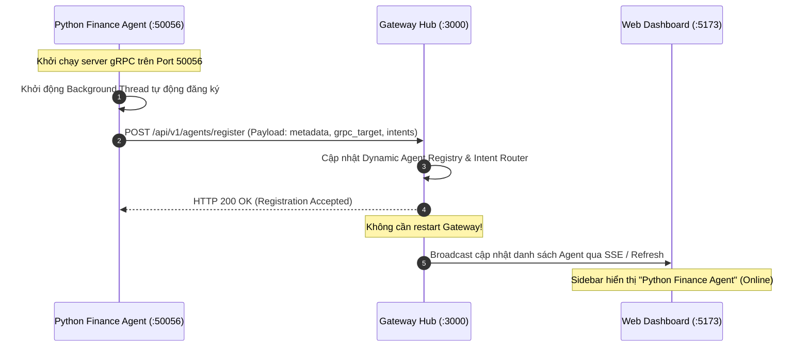

# **VDaAgent Distributed Multi-Agent PoC & Hot-Plugging Prototype**

Tài liệu hướng dẫn kỹ thuật và đặc tả kiến trúc hệ thống **VDaAgent PoC**: Nền tảng Multi-Agent phân tích bất động sản phân tán, giao tiếp qua **gRPC / Protocol Buffers**, hỗ trợ **Evidence-backed Pipeline 6 Core Agents**, cơ chế **Hot-plugging Remote Agent** thời gian thực không downtime, hệ thống **Chatbot Độc lập & Suy luận Chain-of-Thought (CoT)** cho từng Agent, và **Giao diện Trực quan Hai chiều**.

---

## **1. Mục tiêu và Kiến trúc cốt lõi**

### **1.1. Mục tiêu xây dựng**

Xây dựng bản demo phân tán (chạy cục bộ qua localhost) chứng minh các năng lực cốt lõi:

1. **Pipeline 6 LLM Agents phối hợp DAG**: Giải quyết bài toán điều tra phân khu/căn hộ bán chậm (DOM > 90 ngày) theo dữ liệu 4 cấp (*Market $\rightarrow$ Project $\rightarrow$ Zone $\rightarrow$ Unit*) và xuất báo cáo 6 phần có bằng chứng kiểm chứng (*Evidence-backed*).
2. **gRPC Backbone Transport**: Core Orchestrator đóng vai trò gRPC Client (Hub); các Sub-agent đóng vai trò gRPC Server độc lập trên các cổng mạng riêng biệt.
3. **Mỗi Agent là một Chatbot Độc lập**: Ngoài việc tham gia vào pipeline DAG do Orchestrator điều phối, mỗi Sub-agent đều sở hữu chatbox độc lập với chuyên môn riêng (Data, Compare, Insight, Chart, Report, Finance).
4. **Suy luận Reasoning Chain-of-Thought (CoT) trong Chatbox Riêng**: Khi Orchestrator phân công hoặc người dùng chat trực tiếp, agent stream quá trình suy luận từng bước (Reasoning CoT) ngay trong chatbox của mình và trả về output/artifact xác thực.
5. **Zero-downtime Autonomous Hot-plugging**: Remote Agent (ví dụ: `python-finance-agent` trên Port 50056) tự động phát hiện Gateway và gửi request đăng ký `POST /api/v1/agents/register`. Gateway tự động nhận diện và cập nhật dynamic intent router mà không cần nút bấm thủ công trên UI hay khởi động lại hệ thống.
6. **Lưu trữ Lịch sử Phiên (Session Persistence)**: Toàn bộ lịch sử hội thoại của Orchestrator và các sub-agent được lưu trữ liên tục (Server `var/gateway-sessions.json` & Client `localStorage`), tải lại trang F5 không bị mất dữ liệu.
7. **Inspector Điều hướng Hai chiều & Biểu đồ Tương tác**: Cột kiểm tra bên phải (Inspector) hỗ trợ duyệt danh mục tổng quan và chi tiết với nút quay lại (Back), nhúng trực tiếp 3 biểu đồ Recharts tương tác (DOM vs Ngưỡng 90d, Đơn giá vs Benchmark, Tương quan Giá & DOM) với tính năng click tra cứu bằng chứng.

---

### **1.2. Bản đồ phân bổ Port và Service trong Demo**

| Service / Agent | Cổng (Port) | Giao thức | Vai trò & Trách nhiệm |
| :--- | :--- | :--- | :--- |
| **`apps/gateway`** | **3000** | HTTP / SSE | API Gateway, gRPC Hub, Dynamic Router, DAG Orchestrator & Session Store |
| **`apps/web`** | **5173** | HTTP | Giao diện React + Vite: Chatbox đa agent, Stepper, Inspector hai chiều, Recharts |
| **`data-agent`** | **50051** | gRPC | Truy vấn kho dữ liệu BĐS, lọc căn hộ bán chậm (DOM > 90d), sinh `DatasetArtifact` |
| **`compare-agent`** | **50052** | gRPC | Đối chuẩn peer group thị trường, tính độ lệch giá, sinh `ComparisonArtifact` |
| **`insight-agent`** | **50053** | gRPC | Phân tích 3 nguyên nhân gốc rễ, gắn mã bằng chứng trích xuất, sinh `InsightArtifact` |
| **`chart-agent`** | **50054** | gRPC | Thiết lập cấu hình Recharts đa chiều (Bar/Scatter), sinh `ChartSpecArtifact` |
| **`report-agent`** | **50055** | gRPC | Tổng hợp báo cáo 6 phần chuẩn PRD, nhúng biểu đồ và liên kết bằng chứng |
| **`python-finance-agent`** | **50056** | gRPC | **Agent cắm nóng (Python)**: Tính toán hạn mức vay, lãi suất, trả góp gốc lãi |

---

### **1.3. Tech Stack**

| Thành phần | Vai trò | Ngôn ngữ & Runtime | Thư viện & Công nghệ chính |
| :--- | :--- | :--- | :--- |
| **`apps/web`** | Giao diện tương tác người dùng | **TypeScript**, Node.js 22+ | React 19, Vite, Tailwind CSS, Recharts (Interactive SVG Charts), Lucide Icons, Canvas-confetti |
| **`apps/gateway`** | Core Orchestrator & gRPC Hub | **TypeScript**, Node.js 22+ | Hono (HTTP/SSE server), `@grpc/grpc-js`, `@grpc/proto-loader`, Zod, SessionStore file sync |
| **`packages/contracts`** | Data Contracts chuẩn | **TypeScript** | Zod schemas: ArtifactEnvelope, Dataset, Comparison, Insight, ChartSpec, Report |
| **`packages/mock-warehouse`**| CSDL Data Warehouse giả lập | **TypeScript** | Better-SQLite3, Schema 12 bảng BĐS (Vinhomes Ocean Park, Masteri Waterfront) |
| **Core Agents (1-5)** | 5 Sub-agents cốt lõi | **TypeScript**, Node.js 22+ | `@grpc/grpc-js`, `@grpc/proto-loader`, Zod validation, Deterministic Reasoning Streamer |
| **Agent thứ 7 (`finance`)** | **Hot-plugged Remote Agent** | **Python 3.11+ / 3.12** | `grpcio`, `grpcio-tools`, `pydantic` v2, `requests`, Threading auto-register |

---

## **2. Cấu trúc thư mục dự án**

Hệ thống được tổ chức theo mô hình **pnpm monorepo**:

```text
.
├── proto/
│   ├── agent_service.proto           # Định nghĩa gRPC Service: ExecuteStep, CheckHealth
│   └── common_types.proto            # Schema Protobuf: StepExecutionRequest, StepStreamEvent
├── packages/
│   ├── contracts/                    # Zod schemas chuẩn cho Envelope và Domain Artifacts
│   │   ├── src/
│   │   │   ├── envelope.ts           # Schema ArtifactEnvelope theo PRD Section 4.4
│   │   │   └── artifacts.ts          # Schemas: Dataset, Comparison, Insight, ChartSpec, Report
│   │   └── package.json
│   └── mock-warehouse/               # CSDL SQLite giả lập 12 bảng dữ liệu BĐS
│       ├── src/
│       │   ├── db.ts                 # Kết nối SQLite & các hàm truy vấn
│       │   └── seed.ts               # Dữ liệu hạt giống Vinhomes Ocean Park (DOM > 90d)
│       └── package.json
├── apps/
│   ├── web/                          # Giao diện tương tác (React + Vite + Tailwind CSS)
│   │   ├── src/
│   │   │   ├── components/
│   │   │   │   ├── Sidebar.tsx       # Danh sách Agent kèm Icon Loading động khi đang chạy
│   │   │   │   ├── Header.tsx        # Thanh trạng thái, session info, kết nối Gateway
│   │   │   │   ├── chat/             # Chatbox độc lập cho Orchestrator và từng Sub-Agent
│   │   │   │   │   ├── ChatPane.tsx  # Khung chat: hiển thị CoT reasoning stream và output
│   │   │   │   │   ├── MessageItem.tsx # Render tin nhắn, trace group, jump-to-agent buttons
│   │   │   │   │   └── PromptInput.tsx # Ô nhập câu hỏi và gợi ý nghiệp vụ
│   │   │   │   └── inspector/        # Cột kiểm tra bên phải điều hướng 2 chiều
│   │   │   │       ├── EvidenceViewer.tsx # Catalog danh mục căn hộ + Chi tiết + Nút Back
│   │   │   │       ├── ReportViewer.tsx   # Báo cáo 6 phần + 3 biểu đồ Recharts nhúng + Back
│   │   │   │       ├── ChartViewer.tsx    # Trình xem biểu đồ độc lập (DOM, Giá, Tương quan)
│   │   │   │       └── ArtifactList.tsx   # Danh sách toàn bộ Artifacts phát sinh trong session
│   │   │   ├── context/
│   │   │   │   └── ChatContext.tsx   # State management: Chat history, running agents, traces
│   │   │   ├── hooks/
│   │   │   │   └── useAgentChat.ts   # SSE streaming listener & message dispatching
│   │   │   ├── App.tsx
│   │   │   └── main.tsx
│   │   ├── vite.config.ts            # Proxy port 3000 sang Gateway
│   │   └── package.json
│   ├── gateway/                      # Core Orchestrator: Hono HTTP, SSE, gRPC Hub, DAG
│   │   ├── src/
│   │   │   ├── index.ts              # Entry point Hono: REST endpoints & SSE streaming
│   │   │   ├── grpc-hub.ts           # Quản lý connection pool gRPC tới các Sub-agents
│   │   │   ├── dynamic-router.ts     # Phân loại intent & định tuyến tới Agent phù hợp
│   │   │   ├── dag-orchestrator.ts   # Điều phối DAG 4 bước, phát SSE agent_status & agent_message
│   │   │   ├── registry.ts           # Registry động hỗ trợ auto-registration của remote agent
│   │   │   └── session-store.ts      # Lưu trữ phiên hội thoại ra đĩa (var/gateway-sessions.json)
│   │   └── package.json
│   └── agents/                       # 5 Core Sub-agents (mỗi agent là 1 gRPC server độc lập)
│       ├── data-agent/               # Port 50051: Truy vấn mock warehouse, sinh DatasetArtifact
│       ├── compare-agent/            # Port 50052: So sánh peer group, sinh ComparisonArtifact
│       ├── insight-agent/            # Port 50053: Phân tích root-cause có evidence, sinh InsightArtifact
│       ├── chart-agent/              # Port 50054: Cấu hình biểu đồ Recharts, sinh ChartSpecArtifact
│       └── report-agent/             # Port 50055: Tổng hợp báo cáo 6 phần, sinh ReportArtifact
├── external-agents/
│   └── python-finance-agent/         # AGENT THỨ 7 (PYTHON SERVICE CẮM NÓNG)
│       ├── proto/                    # Python gRPC stubs
│       ├── src/
│       │   ├── server.py             # gRPC Server Port 50056 + Threading auto-register
│       │   └── register.py           # Script đăng ký cắm nóng độc lập
│       ├── requirements.txt          # grpcio, grpcio-tools, pydantic, requests
│       └── run.ps1                   # Runner khởi động trên Windows PowerShell
├── scripts/
│   ├── start-all.ts                  # Khởi động toàn bộ: 5 Core Agents + Gateway + Web UI
│   ├── start-core-agents.ts          # Khởi động riêng 5 Core Agents
│   └── run-demo-flow.ts              # Kịch bản kiểm thử tự động E2E (Full pipeline & Hot-plug)
├── var/                              # Thư mục runtime lưu trữ gateway-sessions.json (gitignored)
├── .env.example                      # File mẫu cấu hình biến môi trường
├── .env                              # Cấu hình biến môi trường cục bộ (gitignored)
├── .gitignore                        # Cấu hình bỏ qua tệp tin rác và bí mật
├── README.md                         # Hướng dẫn chi tiết cài đặt và khởi chạy cho người mới
├── AGENT.md                          # Tài liệu kỹ thuật kiến trúc Multi-Agent
├── package.json
└── pnpm-workspace.yaml
```

---

## **3. Đặc tả Giao tiếp gRPC & Data Contracts**

### **3.1. Protobuf Specification (`proto/agent_service.proto` & `common_types.proto`)**

Mọi Sub-agent triển khai interface chuẩn sau:

```protobuf
syntax = "proto3";
package vda.agent.v1;

service SubAgentService {
  // Thực thi bước phân tích và stream quá trình suy luận (Reasoning CoT)
  rpc ExecuteStep (StepExecutionRequest) returns (stream StepStreamEvent);

  // Kiểm tra trạng thái sức khỏe
  rpc CheckHealth (HealthRequest) returns (HealthResponse);
}

message StepExecutionRequest {
  string run_id = 1;
  string task_id = 2;
  string session_id = 3;
  string user_prompt = 4;
  string agent_role = 5;
  repeated InputArtifact input_artifacts = 6;
  string execution_context_json = 7;
}

message InputArtifact {
  string artifact_id = 1;
  string artifact_type = 2;
  string content_json = 3;
}

message StepStreamEvent {
  enum EventType {
    TRACE = 0;    // Suy nghĩ, log suy luận Chain-of-Thought (Reasoning step)
    TOKEN = 1;    // Stream text từng token
    COMPLETE = 2; // Hoàn tất bước, trả về Structured ArtifactEnvelope JSON
    ERROR = 3;    // Báo lỗi thực thi
  }
  EventType type = 1;
  string message = 2;
  string output_artifact_json = 3;
}

message HealthRequest {}
message HealthResponse {
  bool is_healthy = 1;
  string status_message = 2;
}
```

---

### **3.2. Tiêu chuẩn ArtifactEnvelope (`packages/contracts/src/envelope.ts`)**

Mọi kết quả `COMPLETE` từ Sub-agent đều được đóng gói và kiểm chứng qua `ArtifactEnvelopeSchema`:

```typescript
import { z } from 'zod';

export const ArtifactStatusSchema = z.enum(['DRAFT', 'VALID', 'PARTIAL', 'INVALID', 'SUPERSEDED']);

export const ArtifactEnvelopeSchema = z.object({
  artifact_id: z.string(),
  run_id: z.string(),
  task_id: z.string(),
  artifact_type: z.enum(['dataset', 'metric', 'comparison', 'insight', 'chart_spec', 'report', 'finance_plan']),
  schema_version: z.string().default('1.0.0'),
  status: ArtifactStatusSchema.default('VALID'),
  producer: z.string(), // e.g., 'data-agent@1.0.0'
  content_hash: z.string(), // SHA-256 hash của payload
  payload: z.record(z.unknown()), // Dữ liệu nghiệp vụ chuyên biệt
  evidence_refs: z.array(z.string()).default([]), // Danh sách mã căn hộ bằng chứng (e.g., 'UNIT-VH-02')
  input_artifact_refs: z.array(z.string()).default([]),
  limitations: z.array(z.string()).optional(),
  created_at: z.string(),
});

export type ArtifactEnvelope = z.infer<typeof ArtifactEnvelopeSchema>;
```

---

## **4. Đặc tả Hoạt động của Các Agent**

### **4.1. Orchestrator Agent (`apps/gateway/src/dag-orchestrator.ts`)**
- **Trách nhiệm**: Tiếp nhận yêu cầu người dùng, phân tích Intent, điều phối DAG pipeline:
  - **Bước 1**: Gọi `data-agent` (Port 50051) truy vấn dữ liệu căn hộ bán chậm.
  - **Bước 2**: Gọi song song (`Promise.all`) sang `compare-agent` (Port 50052) và `insight-agent` (Port 50053).
  - **Bước 3**: Chuyển dữ liệu sang `chart-agent` (Port 50054) sinh 3 biểu đồ Recharts.
  - **Bước 4**: Chuyển toàn bộ artifacts sang `report-agent` (Port 50055) tổng hợp báo cáo 6 phần.
- **Tách bạch Tiến trình & Đồng bộ Chatbox**:
  - Trong chatbox của Orchestrator: Hiển thị tóm tắt tiến trình theo từng card agent độc lập (`[data-agent]`, `[compare-agent]`, etc.), có nút tắt mở chi tiết và nút nhảy nhanh sang chatbox của agent đó.
  - Phát sự kiện `agent_status` (`running` / `idle`) qua SSE: Kích hoạt icon loading xoay tròn trên Sidebar của đúng agent đang chạy.
  - Lưu và stream sự kiện `agent_message` qua SSE: Đẩy câu lệnh giao việc và nội dung phân tích chi tiết vào chính chatbox riêng của agent được gọi.

### **4.2. Chatbot Độc lập & Suy luận Chain-of-Thought (CoT)**
Mỗi agent hoạt động như một chatbot độc lập:
1. **Data Agent (`agents/data-agent`)**:
   - Chuyên trách: Lọc dữ liệu căn hộ bán chậm (DOM > 90 ngày), phân loại theo phân khu/tầng/view, băm SHA-256 canonical hash bảo đảm tính bất biến.
   - Suy luận CoT: Phân tích câu hỏi $\rightarrow$ Xác định ngưỡng DOM $\rightarrow$ Truy vấn SQLite Warehouse $\rightarrow$ Kiểm tra độ toàn vẹn bản ghi $\rightarrow$ Trả về `DatasetArtifact`.
2. **Compare Agent (`agents/compare-agent`)**:
   - Chuyên trách: Thiết lập đối chuẩn phân khu Sapphire (47.6 tr/m², DOM trung bình 68 ngày) và tính tỷ lệ chênh lệch giá/thời gian lưu kho.
   - Suy luận CoT: Nhận dataset $\rightarrow$ Phân nhóm peer group tương đồng $\rightarrow$ Đo lường khoảng cách phương sai $\rightarrow$ Trả về `ComparisonArtifact`.
3. **Insight Agent (`agents/insight-agent`)**:
   - Chuyên trách: Đào sâu 3 nguyên nhân gốc rễ (Định giá chênh lệch >12%, Hướng ban công Tây Bắc nóng bức tầng thấp, Chính sách hỗ trợ lãi suất hết hạn). Mỗi luận điểm bắt buộc đính kèm mã căn hộ làm bằng chứng (`evidence_id`).
   - Suy luận CoT: Đọc đặc tính căn $\rightarrow$ Đối chiếu giao dịch $\rightarrow$ Trích xuất bằng chứng xác thực $\rightarrow$ Trả về `InsightArtifact`.
4. **Chart Agent (`agents/chart-agent`)**:
   - Chuyên trách: Sinh cấu hình trực quan hóa Recharts cho 3 biểu đồ: DOM vs Ngưỡng 90d (Bar Chart có ReferenceLine), Đơn giá vs Sapphire (Bar Chart), và Tương quan DOM & Giá (Scatter/Dual-Axis Chart).
   - Khả năng thực tế: Sinh dữ liệu biểu đồ thật từ `DatasetArtifact` và `ComparisonArtifact`, cho phép click vào cột/điểm để tra cứu nhanh bằng chứng căn hộ.
5. **Report Agent (`agents/report-agent`)**:
   - Chuyên trách: Tổng hợp báo cáo 6 phần hoàn chỉnh (Tóm tắt, Phạm vi, Chất lượng dữ liệu, Nguyên nhân gốc rễ kèm bằng chứng, Biểu đồ trực quan, Khuyến nghị hành động).
   - Tích hợp Recharts: Báo cáo nhập và nhúng trực tiếp cả 3 biểu đồ trực quan tương tác thay vì chỉ mô tả văn bản thuần túy.
6. **Python Finance Agent (`external-agents/python-finance-agent`)**:
   - Chuyên trách: Tính toán hạn mức cho vay mua nhà (tỷ lệ 70-80%), thời hạn vay 20-35 năm, bảng phân kỳ trả nợ gốc lãi hàng tháng theo dư nợ giảm dần.
   - Tự động cắm nóng: Tự động gửi HTTP POST đăng ký tới Gateway khi chạy server, không cần thao tác nút bấm thủ công trên giao diện.

---

## **5. Cơ chế Hot-Plugging Độc lập Không Downtime**

### **5.1. Luồng Tự động Đăng ký (Autonomous Registration)**



### **5.2. Cấu trúc Payload Đăng ký**

```json
{
  "agent_id": "python-finance-agent",
  "grpc_target": "localhost:50056",
  "domain": "banking_and_finance",
  "description": "Chuyên gia tài chính ngân hàng (Python): Gói vay mua nhà, lịch trả nợ gốc lãi hàng tháng.",
  "supported_intents": ["calculate_mortgage", "compare_loan_packages", "finance_inquiry"]
}
```

---

## **6. Giao diện Người dùng & Trải nghiệm Tương tác (`apps/web`)**

### **6.1. Bố cục 3 Cột Đáp ứng Linh hoạt (Responsive Multi-Device Layout)**
1. **Cột Trái (Sidebar - Danh sách Agent & Quản trị Phiên)**:
   - Danh sách Agent: Orchestrator + 5 Core Agents + Remote Python Agent.
   - Icon động: Khi một agent đang được gọi xử lý, biểu tượng chuyển từ chấm xanh tĩnh sang biểu tượng loading xoay tròn (`Loader2 animate-spin`) và nhãn trạng thái "Đang xử lý...".
   - Thiết kế Responsive: Trên màn hình lớn ($\ge 1024px$), hiển thị cố định $w\text{-72}$. Trên máy tính bảng và điện thoại ($< 1024px$), tự động thu gọn thành ngăn kéo (Slide-over Drawer) với lớp phủ mờ (Backdrop), đóng mở dễ dàng qua nút Hamburger trên thanh điều hướng.
2. **Cột Giữa (Chatbox Tương tác & Trực quan hóa CoT)**:
   - **Orchestrator Mode**: Hiển thị quy trình thực thi phân tách rõ ràng theo từng block agent (`[data-agent]`, `[compare-agent]`, etc.), có nút chuyển nhanh đến chatbox của agent tương ứng.
   - **Individual Agent Mode**: Cho phép trò chuyện 1-1 với từng chuyên gia. Khi agent suy luận, hiển thị visualizer quá trình sinh suy luận Chain-of-Thought (CoT) theo thời gian thực (hộp bóng suy nghĩ màu hổ phách `bg-amber-950/20` có icon `💭`) và xuất output xác thực.
   - Thanh điều hướng Header: Bổ sung nút Hamburger mở danh sách Agent, nhãn trạng thái kết nối, và nút bật/tắt Inspector kèm huy hiệu số lượng artifact hiện có.
   - Lưu trữ phiên: Đồng bộ lịch sử hội thoại trên cả Server (`var/gateway-sessions.json`) và Client (`localStorage`), F5 tải lại trang giữ nguyên 100% dữ liệu.
3. **Cột Phải (Inspector Điều hướng Hai chiều & Kho Lưu Trữ Tạo Phẩm)**:
   - **Artifacts (`ArtifactsViewer`)**:
     - Danh mục toàn diện các Artifacts phát sinh trong phiên (Dataset, Comparison, Insight, Chart Spec, Report, Finance Plan).
     - **Đánh thời gian tạo từng artifact**: Hiển thị rõ mốc thời gian ISO chuẩn hóa sang định dạng tiếng Việt (`HH:mm:ss • DD/MM/YYYY`) kèm mã ID, Producer và trạng thái kiểm thực `VALID`.
     - **Dropdown menu sắp xếp theo ngày tạo**: Cho phép sắp xếp theo *Mới nhất trước (Newest)*, *Cũ nhất trước (Oldest)*, *Loại A $\rightarrow$ Z*, *Loại Z $\rightarrow$ A*, kết hợp ô tìm kiếm và bộ lọc danh mục.
     - **Trình xem chi tiết chống rỗng (No-empty guarantee)**: Hiển thị giao diện trực quan riêng biệt cho từng loại artifact (bảng đối chuẩn Comparison, 3 nguyên nhân Insight có confidence & evidence tags, bảng dữ liệu Dataset, biểu đồ Recharts, báo cáo Report, lịch trả góp Finance) và cho phép mở mã JSON nguồn với nút sao chép nhanh.
   - **Bằng chứng (`EvidenceViewer`)**: Chế độ Catalog hiển thị toàn bộ căn hộ bán chậm và căn hộ đối chuẩn Sapphire; chế độ Chi tiết hiển thị thông tin chuyên sâu của căn hộ kèm 3 nguyên nhân và khuyến nghị. Có nút `< Quay lại danh mục bằng chứng` để dễ dàng duyệt lại.
   - **Báo cáo (`ReportViewer`)**: Hiển thị báo cáo 6 phần với mã bằng chứng click-to-view, nhúng trực tiếp 3 biểu đồ Recharts tương tác đầy đủ, kèm nút mở nhanh Kho Artifacts.
   - **Biểu đồ (`ChartViewer`)**: Trình xem biểu đồ độc lập 3 chế độ (DOM vs 90d, Đơn giá vs Sapphire, Tương quan Giá-DOM).
   - **Kho Dữ Liệu (`DatasetTable`)**: Bảng tra cứu trực tiếp kho dữ liệu SQLite với bộ lọc nhanh căn hộ DOM $\ge 90$ ngày.
   - **Tài Chính (`FinanceViewer`)**: Bảng tính kế hoạch vay vốn và phân rã lịch trả góp gốc lãi hàng tháng từ Python Service.

### **6.2. Thiết Kế Thanh Cuộn Đồng Bộ Dark Theme (Universal Dark Scrollbars)**
- Hệ thống áp dụng cấu hình CSS thanh cuộn đồng bộ toàn diện trên cả thanh cuộn dọc (Vertical) và ngang (Horizontal).
- Sử dụng dải màu Slate/Zinc chuẩn (`track: #0b0f19`, `thumb: #334155`, `hover: #475569`, `active: #0284c7`) triệt tiêu hoàn toàn thanh cuộn trắng/xám mặc định của trình duyệt, tương thích mượt mà trên Chrome, Firefox, Safari và Edge.

---

## **7. Tiêu chí Nghiệm thu Hệ thống (Definition of Done)**

| Hạng mục kiểm tra | Kết quả kỳ vọng đạt được |
| :--- | :--- |
| **gRPC Communication** | Gateway kết nối thành công 5 Core Agents (:50051-:50055) và Python Agent (:50056) qua gRPC; gọi RPC thông suốt không gặp lỗi `UNAVAILABLE`. |
| **Data Immutability & Evidence** | Toàn bộ output trả về từ các agent đều có `content_hash` (SHA-256) và `evidence_refs` hợp lệ, liên kết chính xác tới mã căn hộ trong Mock Warehouse. |
| **Parallel Execution** | Trong DAG pipeline, `compare-agent` và `insight-agent` được kích hoạt và thực thi đồng thời (`Promise.all`). |
| **Autonomous Hot-plugging** | Remote Agent Python tự động gọi `POST /api/v1/agents/register` khi khởi động; Gateway tự động cập nhật dynamic router mà không cần nút bấm thủ công và không cần restart gateway. |
| **Individual Agent Chatbox** | Mỗi agent có giao diện chat riêng, có thể trao đổi độc lập và nhận kết quả phân tích theo chuyên môn của mình. |
| **Reasoning CoT Visualization** | Khi agent được gọi thực thi, chatbox thể hiện các bước suy luận Chain-of-Thought (Reasoning) từng bước trước khi hoàn tất output. |
| **Dynamic Sidebar Loading** | Sidebar hiển thị icon loading xoay tròn (`Loader2 animate-spin`) chính xác tại agent đang chạy, không chỉ riêng Orchestrator. |
| **Session Persistence** | Toàn bộ lịch sử chat của Orchestrator và các sub-agent được lưu trữ liên tục (`gateway-sessions.json` & `localStorage`), F5 không mất dữ liệu. |
| **Dedicated Artifacts Tab** | Cột Inspector bên phải có tab Artifacts chuyên biệt, hiển thị đầy đủ thời gian tạo (`created_at`) và menu dropdown sắp xếp theo ngày tạo (Mới nhất / Cũ nhất). |
| **Artifact Detail Bugfix** | Mọi artifact khi mở từ tab Báo cáo hay danh mục đều hiển thị nội dung chuyên sâu đầy đủ, không còn tình trạng trắng màn hình hay không có nội dung. |
| **Two-Way Navigation** | Cột Inspector hỗ trợ duyệt danh mục tổng quan và chi tiết với nút quay lại (Back) trên cả tab Bằng chứng và tab Báo cáo. |
| **Embedded Recharts** | Báo cáo hoàn chỉnh nhúng trực tiếp 3 biểu đồ Recharts tương tác (DOM vs 90d, Giá vs Sapphire, Tương quan DOM & Giá). |
| **Dark Theme Scrollbars** | Các thanh cuộn ngang và dọc trên toàn bộ giao diện đồng bộ màu sắc tối tinh tế (`#334155` / `#0b0f19`), không bị lệch theme sáng của trình duyệt. |
| **Responsive Design** | Giao diện tự động thích ứng mượt mà trên Mobile, Tablet và Desktop với hệ thống ngăn kéo trượt Slide-over Drawer và nút điều khiển Header. |
