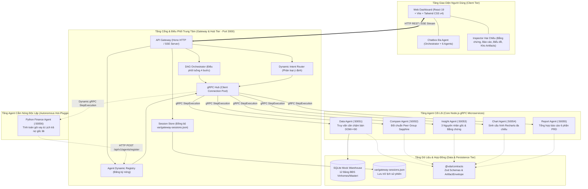
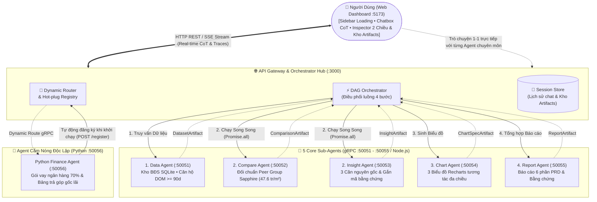
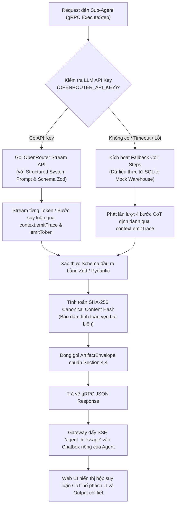
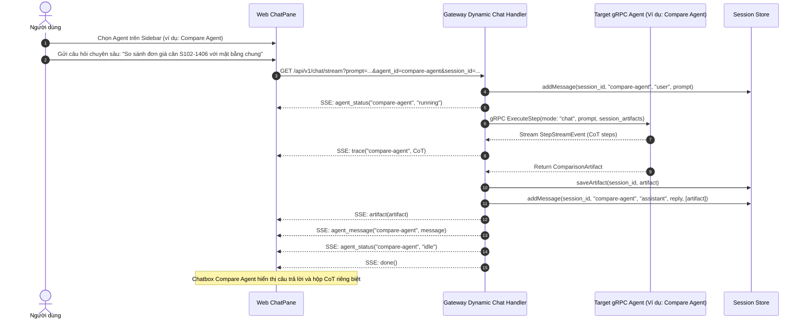
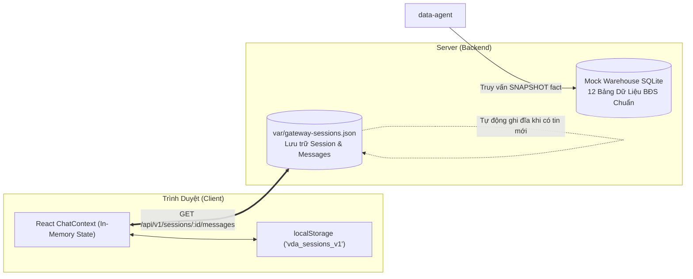

# **Kiến Trúc Hệ Thống VDaAgent (System Architecture)**

Tài liệu đặc tả kiến trúc kỹ thuật toàn diện của hệ thống **VDaAgent Distributed Multi-Agent Platform**: Nền tảng phân tích bất động sản phân tán dựa trên mô hình điều phối **DAG (Directed Acyclic Graph)**, giao tiếp qua **gRPC / Protocol Buffers**, hỗ trợ **Zero-downtime Autonomous Hot-plugging**, hệ thống **Chatbot Độc lập & Suy luận Chain-of-Thought (CoT)** cho từng Agent, và **Giao diện Trực quan Ba cột Hai chiều**.

---

## **1. Tổng quan Kiến trúc (High-Level Architecture)**

Hệ thống VDaAgent được thiết kế theo mô hình **Distributed Multi-Agent Architecture (Mô hình Đa Agent Phân Tán)** kết hợp **Event-Driven Streaming**, bao gồm 4 tầng phân tầng chặt chẽ:



### **1.1. Sơ Đồ Kiến Trúc Đơn Giản Hóa (PoC Quick-Look Diagram)**

> [!TIP]
> **Dành cho các thành viên trong team nắm nhanh PoC trong 30 giây**: Hệ thống hoạt động theo mô hình **Hub-and-Spoke tập trung qua Gateway**. Gateway nhận yêu cầu từ Web UI, vừa điều phối luồng phân tích 4 bước (DAG) qua 5 Core Sub-Agents (gRPC), vừa hỗ trợ chat 1-1 trực tiếp và tự động nhận diện Agent Python cắm nóng qua REST register mà không cần cấu hình thủ công.



---

## **2. Bản đồ Phân Bổ Mạng & Cổng Dịch Vụ (Network & Port Matrix)**

| Thành phần | Cổng (Port) | Giao thức | Công nghệ chính | Trách nhiệm cốt lõi |
| :--- | :--- | :--- | :--- | :--- |
| **`apps/web`** | **5173** | HTTP | React 19, Vite, Tailwind v4, Recharts, Lucide | Giao diện 3 cột responsive, Chatbox CoT, Inspector điều hướng 2 chiều, Kho Artifacts |
| **`apps/gateway`** | **3000** | HTTP / SSE | Hono, Node.js 22+, `@grpc/grpc-js`, Zod | API Gateway, Dynamic Intent Router, DAG Orchestrator, gRPC Hub, Quản lý Session |
| **`data-agent`** | **50051** | gRPC (HTTP/2) | Node.js, Better-SQLite3, Protobuf, Zod | Trích xuất căn hộ chậm bán (DOM $\ge 90$d), tính toán chỉ số, sinh `DatasetArtifact` |
| **`compare-agent`** | **50052** | gRPC (HTTP/2) | Node.js, Protobuf, Zod, CoT Engine | Đối chuẩn phân khu Sapphire (47.6 tr/m², 35d), tính chênh lệch, sinh `ComparisonArtifact` |
| **`insight-agent`** | **50053** | gRPC (HTTP/2) | Node.js, Protobuf, Zod, CoT Engine | Đào sâu 3 nguyên nhân cốt lõi (hướng nắng, giá lệch, hết ưu đãi), sinh `InsightArtifact` |
| **`chart-agent`** | **50054** | gRPC (HTTP/2) | Node.js, Protobuf, Zod, CoT Engine | Tạo đặc tả Recharts đa chiều (DOM vs 90d, Giá vs Chuẩn, Tương quan Giá-DOM) |
| **`report-agent`** | **50055** | gRPC (HTTP/2) | Node.js, Protobuf, Zod, CoT Engine | Tổng hợp Báo cáo Điều tra Toàn diện 6 phần, nhúng 3 biểu đồ Recharts và bằng chứng |
| **`python-finance-agent`** | **50056** | gRPC (HTTP/2) | Python 3.11+, `grpcio`, `pydantic` v2, `requests` | Tự động đăng ký nóng, tính lãi suất vay mua nhà, lịch trả góp dư nợ giảm dần |

---

## **3. Các Luồng Hoạt Động Cốt Lõi (Core System Flows)**

### **3.1. Luồng Điều Phối Pipeline DAG 4 Bước (Hero Flow)**

Khi người dùng gửi câu hỏi phân tích (ví dụ: *"Tại sao phân khu Sapphire có căn hộ bán chậm hơn 90 ngày?"*), Orchestrator kích hoạt quy trình DAG 4 bước:

```mermaid
sequenceDiagram
    autonumber
    actor User as Người dùng
    participant Web as Web Dashboard (:5173)
    participant GW as Gateway / DAG (:3000)
    participant DA as Data Agent (:50051)
    participant CA as Compare Agent (:50052)
    participant IA as Insight Agent (:50053)
    participant CHA as Chart Agent (:50054)
    participant RA as Report Agent (:50055)

    User->>Web: Nhập yêu cầu phân tích
    Web->>GW: GET /api/v1/chat/stream?prompt=...&agent_id=orchestrator
    GW-->>Web: SSE: agent_status(orchestrator, running)
    GW-->>Web: SSE: trace(orchestrator, "Khởi động DAG Pipeline 6 Agents...")

    rect rgb(25, 35, 55)
        note over GW,DA: Bước 1: Khai thác kho dữ liệu BĐS
        GW-->>Web: SSE: agent_status(data-agent, running)
        GW->>DA: gRPC ExecuteStep(user_prompt, filters)
        DA->>DA: Truy vấn SQLite fact_unit_snapshot (DOM >= 90)
        DA-->>GW: Stream StepStreamEvent (Reasoning CoT)
        GW-->>Web: SSE: trace(data-agent, CoT steps)
        DA-->>GW: Return DatasetArtifact (SHA-256 canonical hash)
        GW-->>Web: SSE: artifact(DatasetArtifact)
        GW-->>Web: SSE: agent_message(data-agent, detailed authentic output)
        GW-->>Web: SSE: agent_status(data-agent, idle)
    end

    rect rgb(30, 45, 45)
        note over GW,IA: Bước 2: Thực thi song song (Promise.all) Đối Chuẩn & Căn Nguyên
        GW-->>Web: SSE: agent_status(compare-agent, running)
        GW-->>Web: SSE: agent_status(insight-agent, running)
        par Gọi song song Compare & Insight
            GW->>CA: gRPC ExecuteStep(input: DatasetArtifact)
            CA->>CA: Đối chuẩn Peer Group Sapphire (47.6 tr/m²)
            CA-->>GW: Stream CoT & Return ComparisonArtifact
        and
            GW->>IA: gRPC ExecuteStep(input: DatasetArtifact)
            IA->>IA: Phân tích 3 nguyên nhân cốt lõi gắn evidence_id
            IA-->>GW: Stream CoT & Return InsightArtifact
        end
        GW-->>Web: SSE: artifact(ComparisonArtifact)
        GW-->>Web: SSE: artifact(InsightArtifact)
        GW-->>Web: SSE: agent_message(compare-agent, ...) & agent_status(idle)
        GW-->>Web: SSE: agent_message(insight-agent, ...) & agent_status(idle)
    end

    rect rgb(45, 30, 45)
        note over GW,CHA: Bước 3: Trực quan hóa dữ liệu biểu đồ Recharts
        GW-->>Web: SSE: agent_status(chart-agent, running)
        GW->>CHA: gRPC ExecuteStep(inputs: Dataset, Comparison, Insight)
        CHA->>CHA: Sinh cấu hình Recharts (DOM bar chart, Variance bar, Correlation)
        CHA-->>GW: Stream CoT & Return ChartSpecArtifact
        GW-->>Web: SSE: artifact(ChartSpecArtifact)
        GW-->>Web: SSE: agent_message(chart-agent, ...) & agent_status(idle)
    end

    rect rgb(50, 40, 25)
        note over GW,RA: Bước 4: Tổng hợp Báo cáo 6 Phần PRD
        GW-->>Web: SSE: agent_status(report-agent, running)
        GW->>RA: gRPC ExecuteStep(inputs: Toàn bộ Artifacts)
        RA->>RA: Biên soạn báo cáo 6 phần, liên kết evidence_refs, nhúng 3 biểu đồ
        RA-->>GW: Stream CoT & Return ReportArtifact
        GW-->>Web: SSE: artifact(ReportArtifact)
        GW-->>Web: SSE: agent_message(report-agent, ...) & agent_status(idle)
    end

    GW-->>Web: SSE: agent_message(orchestrator, Tổng kết toàn diện & Trace steps)
    GW-->>Web: SSE: agent_status(orchestrator, idle)
    GW-->>Web: SSE: done(run_id, status: SUCCESS)
```



---

### **3.2. Luồng Cắm Nóng Agent Tự Động (Autonomous Hot-Plugging Flow)**

Khác với các hệ thống cần nút bấm thủ công hoặc khởi động lại Gateway, VDaAgent cho phép một Remote Agent viết bằng bất kỳ ngôn ngữ nào (ví dụ Python) tự động kết nối và phục vụ yêu cầu ngay lập tức:

```mermaid
sequenceDiagram
    autonumber
    participant FA as Python Finance Agent (:50056)
    participant GW as Gateway Core (:3000)
    participant UI as Web Dashboard (:5173)

    Note over FA: 1. Khởi động server gRPC (Port 50056)
    FA->>FA: Khởi tạo Thread tự động đăng ký (AutoRegister Thread)
    FA->>GW: POST /api/v1/agents/register\nPayload: { agent_id: "python-finance-agent", grpc_target: "localhost:50056", supported_intents: ["calculate_mortgage"] }
    
    rect rgb(30, 50, 30)
        Note over GW: 2. Xử lý Hot-Plugging không Downtime
        GW->>GW: grpcHub.registerDynamicClient("python-finance-agent", "localhost:50056")
        GW->>GW: registry.register(payload, is_dynamic=True)
        GW->>GW: dynamicRouter.registerDynamicIntents("calculate_mortgage" -> "python-finance-agent")
        GW-->>FA: HTTP 200 OK { success: true, message: "Agent hot-plugged successfully" }
    end

    Note over UI: 3. UI đồng bộ tức thời
    UI->>GW: Polling / Refresh danh sách Agent (GET /api/v1/agents)
    GW-->>UI: Danh sách 6 agents (Bao gồm Python Finance Agent với tag "DYNAMIC")
    Note over UI: Sidebar hiển thị "Python Finance Agent" (Online - Sẵn sàng)

    Note over UI,GW: 4. Phân luồng câu hỏi tài chính
    UI->>GW: GET /api/v1/chat/stream?prompt=Tôi muốn vay 2 tỷ mua căn hộ Sapphire...
    GW->>GW: dynamicRouter.classifyIntent() -> "calculate_mortgage" -> "python-finance-agent"
    GW->>FA: gRPC ExecuteStep(user_prompt)
    FA-->>GW: Return FinancePlanArtifact
    GW-->>UI: SSE: agent_message + artifact(FinancePlan)
```



---

### **3.3. Luồng Suy Luận Chain-of-Thought (CoT) Đa Kênh**

Mỗi Agent trong hệ thống sở hữu cơ chế suy luận hai chế độ: **LLM Reasoning CoT** (thông qua LLM API với system prompt chuyên sâu) và **Deterministic Fallback CoT** (đảm bảo demo hoạt động mượt mà 100% không gián đoạn):



---

### **3.4. Luồng Trò Chuyện Độc Lập 1-1 Với Từng Agent (Individual Chatbot Flow)**

Bên cạnh luồng Orchestrator tổng thể, người dùng có thể nhấp vào bất kỳ Agent nào ở cột trái để hỏi đáp nghiệp vụ chuyên biệt:



---

## **4. Hợp Đồng Dữ Liệu & Tính Toàn Vẹn Bằng Chứng (Data Contracts & Artifacts)**

### **4.1. Chuẩn Đóng Gói ArtifactEnvelope**
Mọi dữ liệu nghiệp vụ luân chuyển giữa các Agent và lưu trữ trên hệ thống đều tuân thủ chặt chẽ cấu trúc phong bì bất biến:

```typescript
export interface ArtifactEnvelope {
  artifact_id: string;        // UUID định danh duy nhất của artifact
  run_id: string;             // UUID phiên chạy của DAG
  task_id: string;            // ID tác vụ cụ thể của sub-agent
  artifact_type:              // Phân loại kiểu artifact
    | 'dataset' 
    | 'metric' 
    | 'comparison' 
    | 'insight' 
    | 'chart_spec' 
    | 'report' 
    | 'finance_plan';
  schema_version: '1.0.0';    // Phiên bản hợp đồng dữ liệu
  status: 'VALID' | 'DRAFT' | 'REJECTED';
  producer: string;           // Tên định danh agent sản xuất (e.g., 'data-agent@1.0.0')
  content_hash: string;       // Băm SHA-256 canonical hash của payload
  payload: Record<string, unknown>; // Dữ liệu nghiệp vụ chi tiết
  evidence_refs: string[];    // Danh sách mã căn hộ bằng chứng (e.g., ['UNIT-VH-02'])
  input_artifact_refs: string[]; // Danh sách mã artifact đầu vào làm căn cứ
  limitations?: string[];     // Các giới hạn hoặc giả định phân tích
  created_at: string;         // Mốc thời gian ISO 8601 tạo artifact
}
```

### **4.2. Bảng Phân Phối Dữ Liệu Nghiệp Vụ Của Từng Agent**

| Loại Artifact | Agent Sản Xuất | Cấu trúc Payload Đặc Trưng | Bằng chứng đính kèm (`evidence_refs`) |
| :--- | :--- | :--- | :--- |
| **`dataset`** | `data-agent` | Danh sách căn hộ (`units`), chỉ số DOM trung bình, tỷ lệ hấp thụ (`absorption_rate`), bộ lọc truy vấn | `['UNIT-VH-01', 'UNIT-VH-02', 'UNIT-VH-03', 'UNIT-VH-04']` |
| **`comparison`**| `compare-agent` | Giá trị đối chuẩn phân khu (`baseline`), độ lệch đơn giá (`price_variance_pct`), tỷ lệ DOM vượt trội | `['UNIT-VH-02', 'UNIT-VH-05']` (Căn chậm bán vs Căn đã bán nhanh) |
| **`insight`** | `insight-agent` | 3 Nguyên nhân gốc rễ (`root_causes`), mức độ nghiêm trọng, tỷ lệ tự tin (`confidence`), khuyến nghị xử lý | `['UNIT-VH-01', 'UNIT-VH-02', 'UNIT-VH-03']` |
| **`chart_spec`**| `chart-agent` | 3 Cấu hình biểu đồ Recharts (DOM bar chart kèm `ReferenceLine(90)`, Price comparison bar, Price-DOM correlation) | Thừa hưởng từ `dataset` & `comparison` |
| **`report`** | `report-agent` | Văn bản báo cáo toàn diện 6 phần theo chuẩn PRD, tích hợp sẵn 3 biểu đồ Recharts và liên kết bằng chứng | Tổng hợp toàn bộ `evidence_refs` của các bước trước |
| **`finance_plan`**| `python-finance-agent` | Giá trị căn hộ, hạn mức vay (70%), lãi suất ưu đãi vs thả nổi, kỳ hạn vay, bảng khấu hao gốc lãi hàng tháng | Mã căn hộ được chỉ định (e.g., `UNIT-VH-02`) |

---

## **5. Kiến Trúc Giao Diện & Trải Nghiệm Người Dùng (`apps/web`)**

### **5.1. Bố Cục 3 Cột Đáp Ứng Đa Thiết Bị (Responsive 3-Column Architecture)**

```text
+---------------------------------------------------------------------------------------------------------+
|                                              HEADER BAR                                                 |
| [☰ Menu]  Logo VDaAgent  [Session ID: ... ]  [Status: Online ●]                  [📦 Artifacts (6)] [◨] |
+------------------------------------+------------------------------------+-------------------------------+
|       SIDEBAR (Cột Trái)           |      CHATPANE (Cột Giữa)           |     INSPECTOR (Cột Phải)      |
|  - Orchestrator (DAG Coordinator)  |  - Tiêu đề Agent đang chọn         |  - Tab Bằng chứng (Catalog)   |
|  - Data Agent [🌀 Đang xử lý...]   |  - Lịch sử chat (Session Store)    |  - Tab Báo cáo (6 phần + Chart|
|  - Compare Agent [● Online]        |  - CoT Thought Bubble (Màu hổ phách|  - Tab Biểu đồ (Recharts)     |
|  - Insight Agent [● Online]        |  - Trace Logs mở rộng              |  - Tab Kho Dữ liệu (SQLite)   |
|  - Chart Agent [● Online]          |  - Output markdown xác thực        |  - Tab Tài chính (Vay vốn)    |
|  - Report Agent [● Online]         |  - Thẻ bằng chứng click-to-view    |  - Tab Kho Artifacts:         |
|  - Python Finance Agent [Hot-plug] |  - Ô nhập prompt & Gợi ý nghiệp vụ |    * Đánh timestamp tạo       |
|  - Danh sách Phiên (Sessions)      |                                    |    * Dropdown sắp xếp         |
+------------------------------------+------------------------------------+-------------------------------+
```

### **5.2. Các Tính Năng Đột Phá Trên Giao Diện**

1. **Hiển thị Trạng thái Loading Động bên Cột Trái**:
   - Khi Orchestrator phân công bước nào, đúng Agent đó trên Sidebar lập tức chuyển sang biểu tượng loading xoay tròn (`Loader2 animate-spin`) và nhãn `"Đang xử lý..."`.
2. **Trực quan hóa Suy luận Chain-of-Thought (CoT)**:
   - Các bước suy luận trung gian được render trong hộp thông điệp màu hổ phách mềm mại (`bg-amber-950/20 border-amber-800/40`) kèm icon `💭`, cho phép người dùng theo dõi tư duy phân tích của AI trước khi nhận kết quả.
3. **Kho Lưu Trữ Tạo Phẩm Toàn Diện (`ArtifactsViewer`)**:
   - Tích hợp chuyên biệt tại tab **Artifacts** trong Inspector.
   - Hiển thị mốc thời gian tạo (`created_at`) chuẩn hóa định dạng tiếng Việt: `HH:mm:ss • DD/MM/YYYY`.
   - **Menu Dropdown Sắp Xếp**: Sắp xếp theo *Mới nhất trước (Mặc định)*, *Cũ nhất trước*, *Loại A $\rightarrow$ Z*, *Loại Z $\rightarrow$ A*.
   - Bộ lọc danh mục (Pills), ô tìm kiếm theo ID hoặc từ khóa, trình hiển thị trực quan riêng biệt cho từng loại artifact, và nút sao chép JSON nguyên bản.
   - **Cam kết không rỗng (No-empty guarantee)**: Loại bỏ hoàn toàn tình trạng màn hình trắng khi mở artifact từ báo cáo hay danh mục.
4. **Điều hướng Hai Chiều Có Nút Quay Lại (Back Navigation)**:
   - Khi người dùng bấm vào một mã `[Evidence-REF: UNIT-VH-02]` trong Chatbox hoặc Báo cáo, Inspector tự động chuyển sang xem chi tiết căn hộ đó. Nút `< Quay lại danh mục bằng chứng` cho phép quay lại danh sách catalog mà không bị kẹt một chiều.
5. **Thanh Cuộn Đồng Bộ Dark Theme (Universal Dark Scrollbars)**:
   - Cả thanh cuộn dọc và ngang đều được áp dụng màu sắc hài hòa với giao diện tối (`track: #0b0f19`, `thumb: #334155`, `hover: #475569`), tương thích 100% trên các trình duyệt hiện đại.
6. **Thích Ứng Đa Kích Thước (Responsive Breakpoints)**:
   - **Desktop ($\ge 1280px$)**: Hiển thị đầy đủ 3 cột song song làm việc tối đa công suất.
   - **Tablet ($1024px \le W < 1280px$)**: Cột Sidebar hiển thị, Inspector chuyển thành Slide-over Drawer với lớp phủ mờ khi cần mở.
   - **Mobile ($< 1024px$)**: Khung chat chiếm trọn màn hình; Sidebar và Inspector trở thành hai ngăn kéo trượt độc lập điều khiển qua nút Hamburger và nút Inspector trên Header.

---

## **6. Tầng Dữ Liệu & Đồng Bộ Phiên (Persistence & Storage)**



1. **Đồng bộ Phiên Đa Tầng**:
   - Khi có tin nhắn mới hoặc artifact mới, Gateway lưu ngay vào `var/gateway-sessions.json`.
   - Phía Client, `ChatContext` lưu trạng thái vào `localStorage`. Khi người dùng F5 hoặc mở lại trình duyệt, toàn bộ lịch sử trò chuyện và artifact được phục hồi nguyên vẹn.
2. **Kho Dữ Liệu BĐS Chuẩn Hóa (`packages/mock-warehouse`)**:
   - 12 bảng chuẩn hóa bao gồm: `dim_market`, `dim_project`, `dim_zone`, `dim_unit`, `fact_unit_snapshot`, `fact_sales_transaction`, `dim_lead`, `fact_crm_activity`, `fact_ad_performance`, `dim_macro_economic`, `audit_event_log`, `system_config`.
   - Cung cấp dữ liệu thực tế cho các căn hộ bán chậm tại Phân khu The Sapphire 1 (Tòa S1.01, S1.02, S1.05) làm căn cứ đối soát tuyệt đối.
